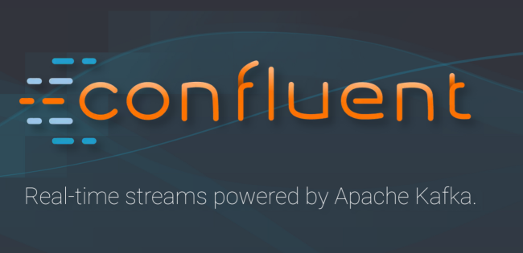
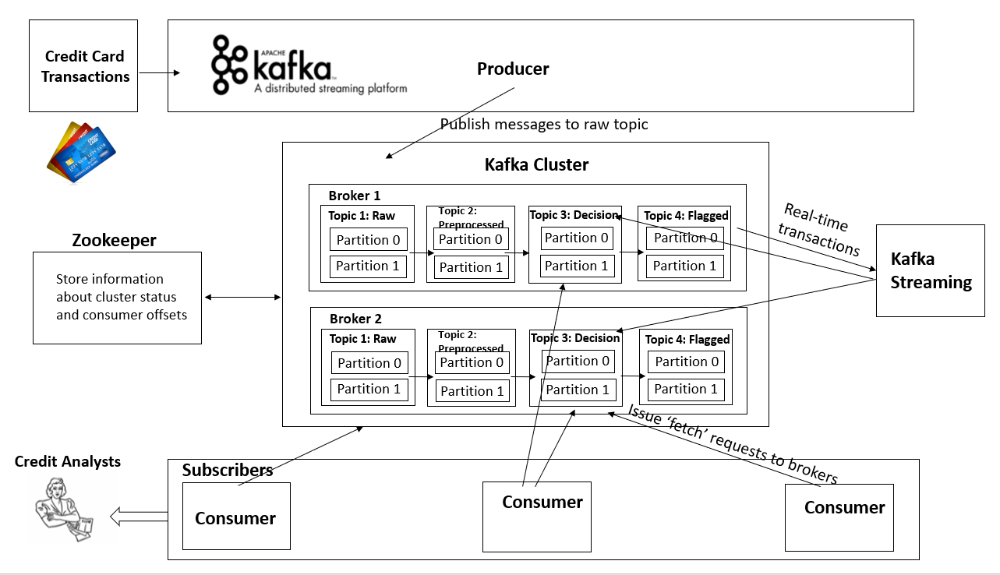
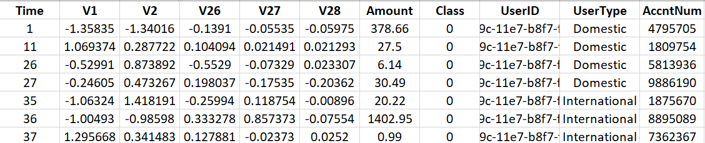

# bdp-kafka

## Quick resources:
 * [Github desktop](https://desktop.github.com/) -- easy source control via a GUa
 * [Docker for Windows Pro](https://store.docker.com/editions/community/docker-ce-desktop-windows)
 * [Docker for Windows Home](https://www.docker.com/products/docker-toolbox)
 * [Docker for Mac](https://store.docker.com/editions/community/docker-ce-desktop-mac)
 * [Kafka Docker](https://hub.docker.com/r/wurstmeister/kafka/) Docker images with instructions on how to install
 * [Miniconda](https://conda.io/miniconda.html) If you need to install Python on your system
 * [Kafka Docker Repository](https://github.com/wurstmeister/kafka-docker) -- Repository for up to date kafka docker images
 * [Kafka project page](https://kafka.apache.org/)
 
## Kafka Stories and Introduction
Apache Kafka is a high-throughput distributed streaming platform and messaging system developed by the Apache Software Foundation written in Scala and Java. 

Apache Kafka was was incubated at LinkedIn to process activity stream data from their website around 2010. Kafka was subsequently open sourced in early 2011. Since then, Kafka has become an Apache open-source project. In November 2014, the original developers left LinkedIn to launch Confluent, an enterprise startup with a focus on Kafka. According to a Quora post from 2014, Jay Kreps seems to have named it after the author Franz Kafka. Kreps chose to name the system after an author because it is "a system optimized for writing", and he liked Kafka's work. 

 

Kafka is implemented as a commit log for a distributed system. In a database context, a "commit" is the application of a single transaction to the database. A commit log is a record of transactions. It's used to keep track of what's happening and help with disaster recovery. In general, all commits are written to the log before being applied. Therefore, transactions that are in flight when the server goes down can be recovered and re-applied by checking the log. 

Kafka aims to provide a unified, high-throughput, low-latency platform for handling real-time data feeds. Kafka could also connect to external systems for data import or export via Kafka Connect and provides Kafka Streams.

Current users of the technology include the likes of LinkedIn, Netflix, Uber, Cisco and Goldman Sachs. Its real-time capabilities make it an ideal solution for emerging Internet of Things services that have to ingest large amounts of data or even large online gaming services.

## Terminology

At a high level, producers send streams of data like messages over the network to the Kafka cluster. Streams of data are safely stored in a distributed replicated cluster. Kafka processes streams of data efficiently and in real-time. Kafka cluster in turn serves them up to consumers. 

There could be many subscribers to a message. We call those subscribers "consumer group". Subscribers store the state of their reads. All the messages in Kafka are real-time and are retained for a specific time period. At LinkedIn, for example, it handled over 800 billion messages every day. We could conduct real-time analytics. It is easy to replay messages.

 * Message: A datum to send
 * Topic: Kafka maintains messages in "topic"
 * Partition: A logical division of a topic; each partition is an ordered, immutable sequence of messages; a partition log is maintained for each topic
 * Producer: An API to publish messages to Kafka topics
 * Broker: A server
 * Cluster: A Kafka cluster comprises one or more brokers
 * Consumer: A Kafka cluster comprises one or more brokers; a consumer is an API to consume messages from topics
 * Replication: Kafka replicates log for earch partition across servers

## Stream Processing
 * Concept: Many users of Kafka process data in processing pipelines consisting of multiple stages, where raw input data is consumed from Kafka topics and then aggregated, enriched, or otherwise transformed into new topics for further consumption or follow-up processing.
 * Library: stream processing library called Kafka Streams is available in Apache Kafka
 
## Project Overview
 

## Dataset - Credit Card Transactions
 * The dataset contains transactions made by credit cards in September 2013 by european cardholders. This dataset presents transactions that occurred in two days, where we have 492 frauds out of 284,807 transactions. Features V1, V2, ... V28 are principal components obtained with PCA. The features which have not been transformed with PCA are 'Time' and 'Amount'. Feature 'Time' contains the seconds elapsed between each transaction and the first transaction in the dataset. The feature 'Amount' is the transaction amount. Feature 'Class' is the response variable and it takes value 1 in case of fraud and 0 otherwise. 
 * We added three fake columns to the Kaggle dataset using R studio: unique user ID, user type (international or domestic) and unique account number
 * Columns appended could be used in furture processing (i.e., aggregation) in application.
 * We split the processed dataset into training and test sets. Test set is split into two partitions. The screenshot shows a sample from the partitions.
  
 * [Kaggle Dataset "Credit Card Transaction"](https://www.kaggle.com/dalpozz/creditcardfraud) 
 * [Download the processed datasets](https://drive.google.com/open?id=1PldjXboPsbWmAhjWxlDUPwLF8_J5i_ka)

## Installation Instructions

 * Install git or the github desktop client
 * Install docker with docker-compose
 * If you need to install python 3, you can use Miniconda above
 * Clone this repository
 * Download the dataset and unzip it
 * Start the docker containers
  ```bash
  docker-compose up -d
   ```
 * Verify that the containers are up. Neither container should say `Exited`
 ```bash
  docker ps -a
 ```
 * To view that the topics were created successfully, we need to use the Kafka container to run the kafka scripts.
 ```bash
  docker exec bdpkafka_kafka_1 bash -c 'kafka-topics.sh  --list --zookeeper $KAFKA_ZOOKEEPER_CONNECT'
 ```
 * You should see 3 topics listed: `raw`, `preprocessed`, `decision`
 * Copy the dataset we're using to seed Kafka to the python container
 ```bash
 docker cp <path_to_downloaded_and_unzipped_dataset> bdpkafka_python_1:/tmp/creditcard.csv
 ```
 * Run the script to push data to the Kafka brokers
 ```bash
 docker exec bdpkafka_python_1 python /bdp/activity_producer.py /tmp/creditcard.csv
 ```
 * Lets verify the messages are there. This involves once again running a command with the kafka  docker container.
 ```bash
 docker exec bdpkafka_kafka_1 bash -c 'kafka-run-class.sh kafka.tools.GetOffsetShell --broker-list kafka:9092 --topic raw'
 ```
 * You should see the number of messages in the topic, which should be one less than the number of lines in your csv file(i.e. minus the header)
 * To stop the docker containers:
 ```bash
 docker-compose down
 ```

## Kafka Pros 
 * In comparison to most messaging systems Kafka has better throughput, built-in partitioning, replication, and fault-tolerance which makes it a good solution for large scale message processing applications.
 * Each message in partition is assigned a sequential ID number called "offset".
 * Fast reads and writes due to sequential reads and writes only
 * Does one thing and one thing only i.e. to transfer messages reliably
 * Does provide load balancing of consumers via partitions of topic so real parallel-processing no ifs and buts
 * No restrictions on transaction numbers unlike Kinesis
 
## Kafka Cons
 * Complicated to setup cluster compared to rabbitmq
 * Dependency on Zookeeper
 * No Routing

## Kafka Adoption across Industry


 * Kafka is applied in the real-time streaming data architectures to provide real-time analytics. Since Kafka is a fast, scalable, durable, and fault-tolerant publish-subscribe messaging system, Kafka is used in use cases where JMS, RabbitMQ, and AMQP may not even be considered due to volume and responsiveness. Kafka has higher throughput, reliability and replication characteristics which make it applicable for things like tracking service calls (tracks every call) or track IOT sensors data where a traditional MOM might not be considered.
 * It's also appropriate for stream processing, website activity tracking, metrics collection and monitoring, log aggregation, real-time analytics, CEP, ingesting data into Spark, ingesting data into Hadoop, CQRS, replay messages, error recovery, and guaranteed distributed commit log for in-memory computing (microservices).
 * LinkedIn uses Kafka to track activity data and operational metrics. Twitter uses it as part of Storm to provide a stream processing infrastructure. Square uses Kafka as a bus to move all system events to various Square data centers (logs, custom events, metrics, and so on), outputs to Splunk, Graphite (dashboards), and to implement an Esper-like/CEP alerting systems.
 
## Credit Analyst - Model
 * Credit analysts could use machine learning techniques to train transaction data to identify fraudulent. 
  * [Logistic Regression](https://github.com/fimuchka/bdp-kafka/blob/feature/intallation/Fraud%20Detection.ipynb)
  * [Random Forest](https://github.com/fimuchka/bdp-kafka/blob/feature/Lizzy1/creditcard%20fraud%20detection%20model.ipynb)
  * [Decision Tree](https://github.com/fimuchka/bdp-kafka/blob/feature/jfan33/fraudDetect1-Jessie.py)
 
## References
 * [A distributed streaming platform](https://www.slideshare.net/ConfluentInc/apache-kafkaa-distributed-streaming-platform)
 * [Confluent Closes $24M Series B Round For Its Apache Kafka-Based Stream Data Platform](https://techcrunch.com/2015/07/08/confluent-closes-24m-series-b-round-for-its-apache-kafka-based-stream-data-platform/?ncid=rss&utm_source=TweetDeck&utm_medium=twitter&utm_campaign=Feed%3A+Techcrunch+%28TechCrunch%29)
 * [What is Apache Kafka?](http://cloudurable.com/blog/what-is-kafka/index.html)
 * [Why Kafka?](https://marutsingh.com/2016/09/12/why-kafka/)
 * [Apache Kafka org](https://kafka.apache.org/documentation/#design)
